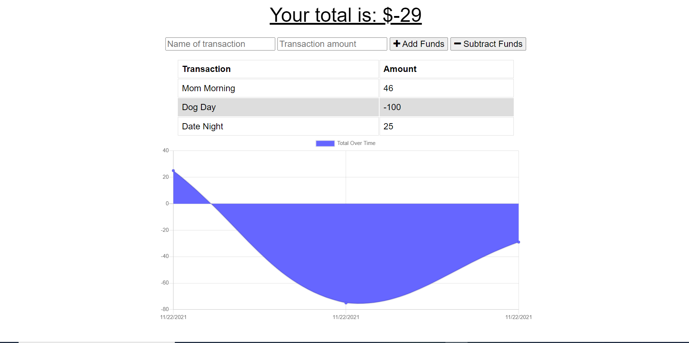

# budget-tracker

## Description

A budget tracking tool that can be used offline or online - allows users to record their deposits/withdrawals and visualize their cash flow overtime.

## Local installation notes

1. Prepare a mongo database for storing data -- add these details to your server.js
2. Run `npm install` to install dependencies
3. Run `nodemon server.js` to run the application

Find me on Github

https://github.com/andrewroddy92
